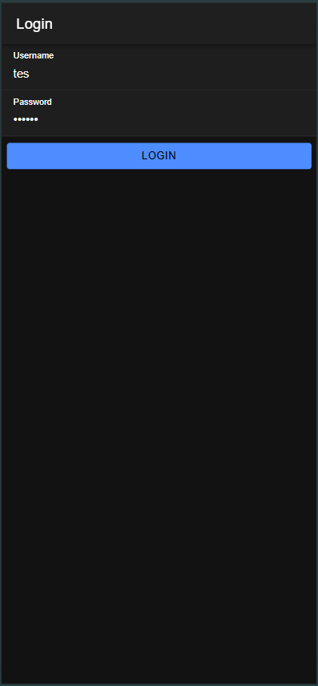
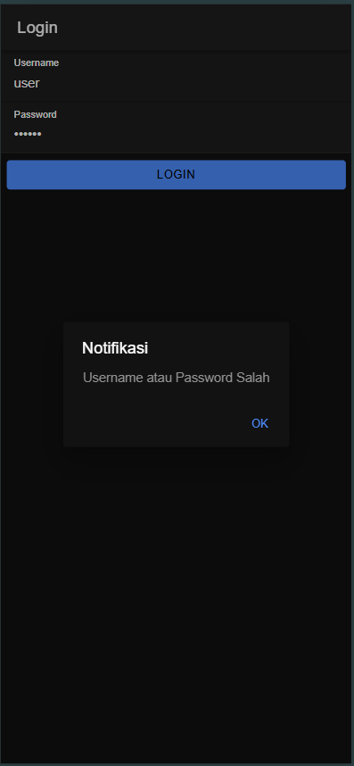
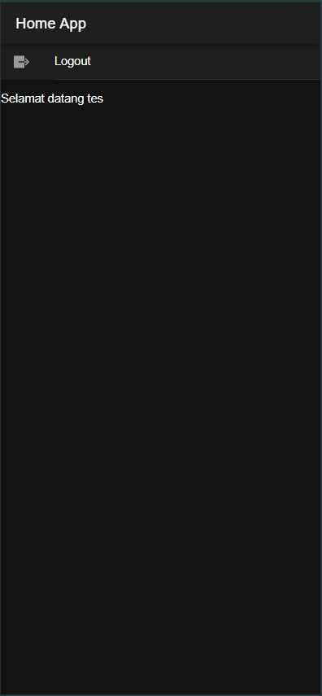

# Tugas Pertemuan 7
IONIC

Nama: Azzam Dicky Umar Widadi 
NIM: H1D022090  
Shift KRS: D
Shift Baru: F

## Screenshot

## Penjelasan Program
### 1. Database
Database coba-ionic dibuat untuk menyimpan informasi login. Di dalam database ini, terdapat tabel user yang berisi kolom username dan password. Password disimpan dalam bentuk hash MD5 untuk meningkatkan keamanan.
### 2. API Backend
file `koneksi.php` digunakan untuk menghubungkan aplikasi dengan database MySQL menggunakan mysqli_connect. 
file `login.php` menerima data username dan password dari aplikasi, mencocokkannya dengan data di database. Jika cocok, mengembalikan status berhasil beserta token dan username; jika tidak, mengembalikan status gagal.
### 3. Konfigurasi Angular untuk API
Di `app.module.ts`, aplikasi mengaktifkan `HttpClient` untuk berkomunikasi dengan API.
### 4. Authentication Service
- Penyimpanan Data Sesi: Token dan `username` disimpan di aplikasi menggunakan `Capacitor Preferences` agar sesi login tetap aktif.
- Proses Login: Mengirim data `username` dan `password` ke `login.php`. Jika login berhasil, data sesi disimpan dan status login berubah menjadi `true`.
- Logout: Menghapus data sesi, mengubah status login menjadi `false`.
### 5. Halaman Login
- Tampilan (login.page.html): Menyediakan form `username` dan `password`.
- Fungsi Login (login.page.ts):
  - Mengirim data ke API untuk pengecekan.
  - Jika berhasil, data sesi disimpan dan pengguna diarahkan ke halaman `home`.
  - Jika gagal, menampilkan notifikasi kesalahan.
### 6. Guard untuk Proteksi Akses
authGuard: Mencegah pengguna yang belum login mengakses halaman `home`.
autoLoginGuard: Mengarahkan pengguna yang sudah login langsung ke halaman `home`jika mencoba masuk ke halaman login lagi.
### 7. Navigasi dan Halaman Home
Routing: Mengaktifkan guard untuk memastikan akses yang sesuai bagi halaman `login` dan `home`.
Halaman Home (home.page.ts): Menampilkan nama pengguna yang sedang login dan menyediakan tombol `Logout` untuk keluar.

## Alur
1. Pengguna memasukkan `username` dan `password`, kemudian aplikasi mengirim data ke `login.php`.
2. API memverifikasi data di database dan mengirim respons status login.
3. Jika berhasil, aplikasi menyimpan token sesi dan mengarahkan pengguna ke halaman `home`.
4. Guard mengatur akses halaman agar hanya pengguna yang terautentikasi dapat melihat halaman `home`.
5. Pengguna dapat logout untuk menghapus data sesi dan kembali ke halaman login.